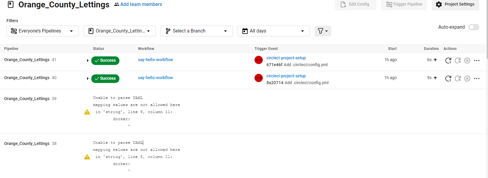
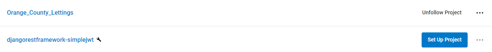
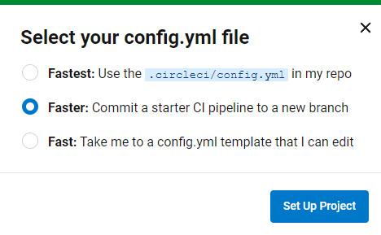

.. _circleci:

**Circle CI**
============

.. important::

    .. image:: https://img.shields.io/badge/circle%20ci-%23161616.svg?style=for-the-badge&logo=circleci&logoColor=white
        :alt: CircleCi Badge
        :target: https://circleci.com/docs/

    Parameterizations are done to a specific project. To parameterize to the other project, go to the official 
    documentation.
-------------------------------------------------------------------------------------------------------------------------------------------------------------------------------------------

****************
What is CircleCi
****************

CircleCI is a continuous integration and continuous deployment (CI/CD) 
tool widely used in software development.
Pipelines in CircleCI are automated workflows that describe how code is compiled, tested, and deployed.

-------------------------------------------------------------------------------------------------------------------------------------------------------------------------------------------

*************
Pipline CI/CD
*************

A pipeline in the context of continuous integration (CI) and continuous deployment (CD) is a 
series of automated steps that are executed in a specific order to test and deploy the code consistently 
and reliably.

.. _ma_figure:

   :download:`Download <_static/pepline_problem.png>`

-------------------------------------------------------------------------------------------------------------------------------------------------------------------------------------------

*********
.circleci
*********

.. rubric:: Create a folder .circleci

We need to create a folder ``.circleci`` at the project level so that when the project is created, the ``config.py`` 
file is automatically placed inside it.

.. code-block:: console

        mkdir .circleci

-------------------------------------------------------------------------------------------------------------------------------------------------------------------------------------------

*********
config.py
*********

This file can be created and automatically positioned in the ``.cirlceci``. folder. 
A ``circleci-project-setup`` branch is created. Either you have to configure on this branch, 
or you have to gather it on the Master branch.

-------------------------------------------------------------------------------------------------------------------------------------------------------------------------------------------

.. _ma_figure:

   :download:`Download <_static/create_circle_ci.png>`

-------------------------------------------------------------------------------------------------------------------------------------------------------------------------------------------

.. _ma_figure:

   :download:`Download <_static/config_circle_file.png>`

-------------------------------------------------------------------------------------------------------------------------------------------------------------------------------------------

.. rubric:: config.py script

.. code-block:: python

        # Use the latest 2.1 version of CircleCI pipeline process engine.
        # See: https://circleci.com/docs/configuration-reference
        version: 2.1

        # Define a job to be invoked later in a workflow.
        # See: https://circleci.com/docs/jobs-steps/#jobs-overview & https://circleci.com/docs/configuration-reference/#jobs
        jobs:
        say-hello:
            # Specify the execution environment. You can specify an image from Docker Hub or use one of our convenience images from CircleCI's Developer Hub.
            # See: https://circleci.com/docs/executor-intro/ & https://circleci.com/docs/configuration-reference/#executor-job
            docker:
            # Specify the version you desire here
            # See: https://circleci.com/developer/images/image/cimg/base
            - image: cimg/base:current

            # Add steps to the job
            # See: https://circleci.com/docs/jobs-steps/#steps-overview & https://circleci.com/docs/configuration-reference/#steps
            steps:
            # Checkout the code as the first step.
            - checkout
            - run:
                name: "Say hello"
                command: "echo Hello, World!"

        # Orchestrate jobs using workflows
        # See: https://circleci.com/docs/workflows/ & https://circleci.com/docs/configuration-reference/#workflows
        workflows:
        say-hello-workflow: # This is the name of the workflow, feel free to change it to better match your workflow.
            # Inside the workflow, you define the jobs you want to run.
            jobs:
            - say-hello

-------------------------------------------------------------------------------------------------------------------------------------------------------------------------------------------

.. rubric:: Merge branches

We must position ourselves on the marster branch.

.. code-block:: python

        git checkout master

-------------------------------------------------------------------------------------------------------------------------------------------------------------------------------------------

Then we can gather the branches, if necessary.

.. code-block:: python

        git merge circleci-project-setup

-------------------------------------------------------------------------------------------------------------------------------------------------------------------------------------------

*******

*******

-------------------------------------------------------------------------------------------------------------------------------------------------------------------------------------------

*****************

*****************

-------------------------------------------------------------------------------------------------------------------------------------------------------------------------------------------

****************

****************

-------------------------------------------------------------------------------------------------------------------------------------------------------------------------------------------

*****************

*****************

-------------------------------------------------------------------------------------------------------------------------------------------------------------------------------------------