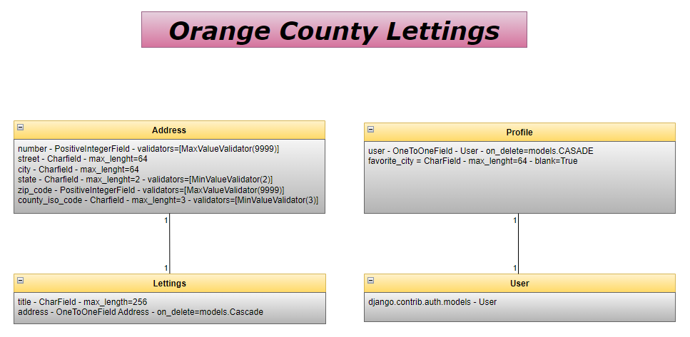

.. _data_structure:

**Data structure**
==================

.. important::

    .. image:: https://img.shields.io/badge/sqlite-%2307405e.svg?style=for-the-badge&logo=sqlite&logoColor=white
        :alt: Sqlite Badge
        :target: https://www.sqlite.org/index.html

    Parameterizations are done to a specific project. To parameterize to the other project, go to the official 
    documentation `SQLite <https://www.sqlite.org/index.html>`_.

-------------------------------------------------------------------------------------------------------------------------------------------------------------------------------------------

*************
Project table
*************

+-------------+---------------------------------------------+
| **letting** | Name of the properties                      |
+-------------+---------------------------------------------+
| **address** | Contains postal addresses of the properties |
+-------------+---------------------------------------------+
| **profile** | Contains the country preference of the user |
+-------------+---------------------------------------------+

-------------------------------------------------------------------------------------------------------------------------------------------------------------------------------------------

To have a graphical interface, it is better to use the free software `DB Browser for SQLite <https://sqlitebrowser.org/dl/>`_.

-------------------------------------------------------------------------------------------------------------------------------------------------------------------------------------------

*******
Address
*******

* verbose_name = "Address"
* verbose_name_plural = "Addresses"

+----------------------+----------------------+---------------------------------------+------------------------------------+
| **number**           | PositiveIntegerField | validators=[MaxValueValidator(9999)]  |                                    |
+----------------------+----------------------+---------------------------------------+------------------------------------+
| **street**           | CharField            | max_length=64                         |                                    |
+----------------------+----------------------+---------------------------------------+------------------------------------+
| **city**             | CharField            | max_length=64                         |                                    |
+----------------------+----------------------+---------------------------------------+------------------------------------+
| **state**            | CharField            | max_length=2                          | validators=[MinLengthValidator(2)] |
+----------------------+----------------------+---------------------------------------+------------------------------------+
| **zip_code**         | PositiveIntegerField | validators=[MaxValueValidator(99999)] |                                    |
+----------------------+----------------------+---------------------------------------+------------------------------------+
| **country_iso_code** | CharField            | max_length=3                          | validators=[MinLengthValidator(3)] |
+----------------------+----------------------+---------------------------------------+------------------------------------+

-------------------------------------------------------------------------------------------------------------------------------------------------------------------------------------------

********
Lettings
********

+-------------+---------------+----------------+--------------------------+
| **title**   | CharField     | max_length=256 |                          |
+-------------+---------------+----------------+--------------------------+
| **address** | OneToOneField | Address        | on_delete=models.CASCADE |
+-------------+---------------+----------------+--------------------------+

-------------------------------------------------------------------------------------------------------------------------------------------------------------------------------------------

*******
Profile
*******

+-------------------+-----------+--------------------------+------------+
| **user**          | User      | on_delete=models.CASCADE |            |
+-------------------+-----------+--------------------------+------------+
| **favorite_city** | CharField | max_length=64            | blank=True |
+-------------------+-----------+--------------------------+------------+

-------------------------------------------------------------------------------------------------------------------------------------------------------------------------------------------

******
Schema
******

.. _ma_figure:

.. raw:: html

   

       
   

-------------------------------------------------------------------------------------------------------------------------------------------------------------------------------------------