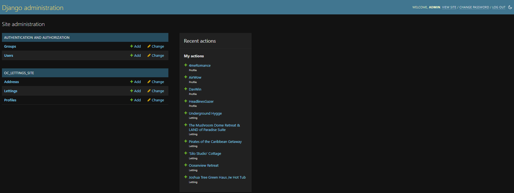
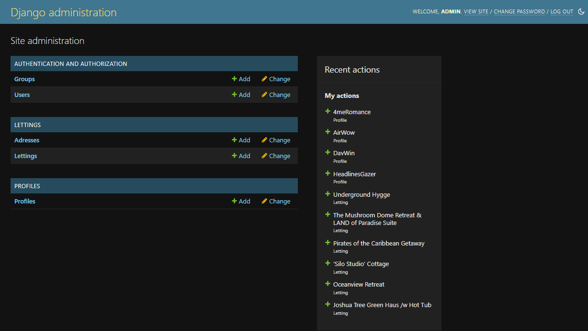

.. _data_structure:

**Data structure**
==================

.. important::

    .. image:: https://img.shields.io/badge/sqlite-%2307405e.svg?style=for-the-badge&logo=sqlite&logoColor=white
        :alt: Sqlite Badge
        :target: https://www.sqlite.org/index.html

    Parameterizations are done to a specific project. To parameterize to the other project, go to the official 
    documentation `SQLite <https://www.sqlite.org/index.html>`_.

-------------------------------------------------------------------------------------------------------------------------------------------------------------------------------------------

*********************
Admin start structure
*********************

.. _ma_figure:

.. raw:: html

   

       
   

-------------------------------------------------------------------------------------------------------------------------------------------------------------------------------------------

*************
Project table
*************

+-------------+---------------------------------------------+
| **letting** | Name of the properties                      |
+-------------+---------------------------------------------+
| **address** | Contains postal addresses of the properties |
+-------------+---------------------------------------------+
| **profile** | Contains the country preference of the user |
+-------------+---------------------------------------------+

-------------------------------------------------------------------------------------------------------------------------------------------------------------------------------------------

To have a graphical interface, it is better to use the free software `DB Browser for SQLite <https://sqlitebrowser.org/dl/>`_.

-------------------------------------------------------------------------------------------------------------------------------------------------------------------------------------------

*******
Address
*******

**Singular** and **plural**

* verbose_name = "Address"
* verbose_name_plural = "Addresses"

**Address information**

+----------------------+------------------------------------------+
| **id**               | Automated incremental number, primary key|
+----------------------+------------------------------------------+
| **number**           | Street number, max value 9999            |
+----------------------+------------------------------------------+
| **street**           | Name of the street, 64 characters max    |
+----------------------+------------------------------------------+
| **city**             | City's name, 64 characters max           |
+----------------------+------------------------------------------+
| **state**            | State's code, 2 characters max           |
+----------------------+------------------------------------------+
| **zip_code**         | Max value 99999                          |
+----------------------+------------------------------------------+
| **country_iso_code** | Country's ISO code, 3 characters max     |
+----------------------+------------------------------------------+

**Models structure**

+----------------------+----------------------+---------------------------------------+------------------------------------+
| **number**           | PositiveIntegerField | validators=[MaxValueValidator(9999)]  |                                    |
+----------------------+----------------------+---------------------------------------+------------------------------------+
| **street**           | CharField            | max_length=64                         |                                    |
+----------------------+----------------------+---------------------------------------+------------------------------------+
| **city**             | CharField            | max_length=64                         |                                    |
+----------------------+----------------------+---------------------------------------+------------------------------------+
| **state**            | CharField            | max_length=2                          | validators=[MinLengthValidator(2)] |
+----------------------+----------------------+---------------------------------------+------------------------------------+
| **zip_code**         | PositiveIntegerField | validators=[MaxValueValidator(99999)] |                                    |
+----------------------+----------------------+---------------------------------------+------------------------------------+
| **country_iso_code** | CharField            | max_length=3                          | validators=[MinLengthValidator(3)] |
+----------------------+----------------------+---------------------------------------+------------------------------------+

-------------------------------------------------------------------------------------------------------------------------------------------------------------------------------------------

********
Lettings
********

**Lettings information**

+-------------+------------------------------------------------------+
| **id**      | Automated incremental number, primary key            |
+-------------+------------------------------------------------------+
| **title**   | The name of the property to rent, max characters 255 |
+-------------+------------------------------------------------------+
| **address** | Foreignkey to addresses                              |
+-------------+------------------------------------------------------+

**Models structure**

+-------------+---------------+----------------+--------------------------+
| **title**   | CharField     | max_length=256 |                          |
+-------------+---------------+----------------+--------------------------+
| **address** | OneToOneField | Address        | on_delete=models.CASCADE |
+-------------+---------------+----------------+--------------------------+

-------------------------------------------------------------------------------------------------------------------------------------------------------------------------------------------

********
Profiles
********

**User information**

+-------------------+---------------------------------------------------+
| **id**            | automated incremental number, primary key         |
+-------------------+---------------------------------------------------+
| **user**          | foreignkey to user's table                        |
+-------------------+---------------------------------------------------+
| **favorite_city** | the favorite city of the user, 64 characters max  |
+-------------------+---------------------------------------------------+

**Models structure**

+-------------------+-----------+--------------------------+------------+
| **user**          | User      | on_delete=models.CASCADE |            |
+-------------------+-----------+--------------------------+------------+
| **favorite_city** | CharField | max_length=64            | blank=True |
+-------------------+-----------+--------------------------+------------+

-------------------------------------------------------------------------------------------------------------------------------------------------------------------------------------------

******
Schema
******

.. _ma_figure:

.. figure:: _static/database_structure.png
   :height: 400
   :width: 700
   :scale: 80
   :align: center
   :alt: Database structure`

.. raw:: html

   

       
   

-------------------------------------------------------------------------------------------------------------------------------------------------------------------------------------------

*******************
Admin end structure
*******************

.. _ma_figure:

.. raw:: html

   

       
   

