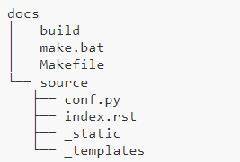
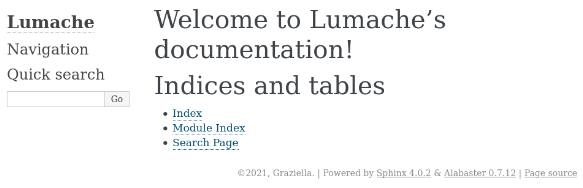

.. _documentation:

**Documentation**
=================

********
Creation
********

.. important::

    .. image:: https://img.shields.io/badge/sphinx-%23C4302B.svg?style=for-the-badge&logo=sphinx&logoColor=white
        :alt: Sphinx Badge
        :target: https://www.sphinx-doc.org/en/master/index.html

    **After creating the project** and activating the virtual environment, you can start.
    To start create documentation, you must install `Sphinx <https://www.sphinx-doc.org/en/master/index.html>`_ 

-------------------------------------------------------------------------------------------------------------------------------------------------------------------------------------------

⏩️ Install Sphinx

.. code-block:: console

   pipenv install sphinx

-------------------------------------------------------------------------------------------------------------------------------------------------------------------------------------------

⚙️ Creating the documentation layout (``docs``)

.. code-block:: console

   sphinx-quickstart docs

This will present to you a series of questions required to create the basic directory and configuration layout for your 
project inside the docs folder. To proceed, answer each question as follows:

* Separate source and build directories (y/n) [n]: y

* Project name: Orange County Lettings

* Author name: Laurent Jouron

* Project release []: 0.1

* Project language [en]: Leave it empty (the default, English) and press Enter.

-------------------------------------------------------------------------------------------------------------------------------------------------------------------------------------------

*******
Project
*******

After the last question, you will see the new docs directory with the following content.

-------------------------------------------------------------------------------------------------------------------------------------------------------------------------------------------

The purpose of each of these files is:

💡build/

* An empty directory (for now) that will hold the rendered documentation.

💡make.bat and Makefile

* Convenience scripts to simplify some common Sphinx operations, such as rendering the content.

💡source/conf.py

* A Python script holding the configuration of the Sphinx project. It contains the project name and release you specified to sphinx-quickstart, as well as some extra configuration keys.

💡source/index.rst

* The root document of the project, which serves as welcome page and contains the root of the “table of contents tree” (or toctree).

-------------------------------------------------------------------------------------------------------------------------------------------------------------------------------------------

⚙️ Build docs/build/

Thanks to this bootstrapping step, you already have everything needed to render the documentation as HTML for the first time. 
To do that, run this command:

.. code-block:: console

   sphinx-build -M html docs/source/ docs/build/

And finally, open docs/build/html/index.html in your browser. You should see something like this:

-------------------------------------------------------------------------------------------------------------------------------------------------------------------------------------------

⏩️ Position yourself in the docs folder

.. code-block:: console

   cd docs

-------------------------------------------------------------------------------------------------------------------------------------------------------------------------------------------

⚙️ make html

This command must be retained because this command will be repeated with each modification.

.. code-block:: console

   .\make html

-------------------------------------------------------------------------------------------------------------------------------------------------------------------------------------------

*****************
.readthedocs.yaml
*****************

To realize this documentation I used this configuration for the file ``.readthedocs.yaml``

⚙️ .readthedocs.yaml

.. code-block:: python

    # Required
    version: 2

    # Set the OS, Python version and other tools you might need
    build:
    os: ubuntu-22.04
    tools:
        python: "3.12"

    # Build documentation in the "docs/" directory with Sphinx
    sphinx:
    configuration: docs/source/conf.py

    python:
    install:
        - requirements: docs/requirements.txt

-------------------------------------------------------------------------------------------------------------------------------------------------------------------------------------------

*******
conf.py
*******

To realize this documentation I used this configuration for the file ``conf.py``

⚙️ ``conf.py``

.. code-block:: python

    # Configuration file for the Sphinx documentation builder.
    #
    # For the full list of built-in configuration values, see the documentation:
    # https://www.sphinx-doc.org/en/master/usage/configuration.html

    # -- Project information -----------------------------------------------------
    # https://www.sphinx-doc.org/en/master/usage/configuration.html#project-information

    project = "Orange County Lettings"
    copyright = "2024, Laurent Jouron"
    author = "Laurent Jouron"
    release = "1.0.0"

    # -- General configuration ---------------------------------------------------
    # https://www.sphinx-doc.org/en/master/usage/configuration.html#general-configuration

    extensions = [
        "sphinx_copybutton",
        "sphinx.ext.duration",
        "sphinx.ext.autodoc",
        "sphinx.ext.doctest",
        "sphinx.ext.intersphinx",
        "sphinx.ext.todo",
    ]

    autodoc_default_flags = []

    autodoc_modules = {
        "lettings": "lettings",
        "profiles": "profiles",
        "oc_lettings_site": "oc_lettings_site",
    }

    # The suffix of source filenames.
    source_suffix = {
        ".rst": "restructuredtext",
        ".txt": "restructuredtext",
        ".md": "markdown",
    }

    # The master toctree document.
    master_doc = "index"

    templates_path = ["_templates"]
    exclude_patterns = ["_build", "Thumbs.db", ".DS_Store"]

    # The name of the Pygments (syntax highlighting) style to use.
    pygments_style = "sphinx"
    epub_show_urls = "footnote"

    # -- Options for HTML output -------------------------------------------------
    # https://www.sphinx-doc.org/en/master/usage/configuration.html#options-for-html-output

    html_theme_options = {
        "display_version": False,
        "style_external_links": True,
    }

    html_theme = "sphinx_rtd_theme"
    html_logo = "_static/logo.png"
    html_static_path = ["_static"]

-------------------------------------------------------------------------------------------------------------------------------------------------------------------------------------------

****************
requirements.txt
****************

To realize this documentation I used this configuration for the file ``requirements.txt``

⚙️ requirements.txt

.. code-block:: Python

    Sphinx==7.2.6
    sphinx-rtd-theme==1.3.0
    sphinx-bootstrap-theme
    sphinx-copybutton

-------------------------------------------------------------------------------------------------------------------------------------------------------------------------------------------

*****************
Schema of the doc
*****************

Circle CI
~~~~~~~~~

* :doc:`Circle CI <circleci>`

  - `What is Circle CI <https://laurent-lettings.readthedocs.io/en/latest/circleci.html#what-is-circleci>`_
  - `Pipeline CI/CD <https://laurent-lettings.readthedocs.io/en/latest/circleci.html#pipelines-ci-cd>`_
  - `.circleci <https://laurent-lettings.readthedocs.io/en/latest/circleci.html#id1>`_
  - `config.py <https://laurent-lettings.readthedocs.io/en/latest/circleci.html#config-py>`_

-------------------------------------------------------------------------------------------------------------------------------------------------------------------------------------------

Data structure
~~~~~~~~~~~~~~

* :doc:`Data structure <data_structure>`

  - `Admin start structure <https://laurent-lettings.readthedocs.io/en/latest/data_structure.html#admin-start-structure>`_
  - `Project table <https://laurent-lettings.readthedocs.io/en/latest/data_structure.html#project-table>`_
  - `Address <https://laurent-lettings.readthedocs.io/en/latest/data_structure.html#address>`_
  - `Lettings <https://laurent-lettings.readthedocs.io/en/latest/data_structure.html#lettings>`_
  - `Profiles <https://laurent-lettings.readthedocs.io/en/latest/data_structure.html#profiles>`_
  - `Schema <https://laurent-lettings.readthedocs.io/en/latest/data_structure.html#schema>`_
  - `Admin end structure <https://laurent-lettings.readthedocs.io/en/latest/data_structure.html#admin-end-structure>`_

-------------------------------------------------------------------------------------------------------------------------------------------------------------------------------------------

Description
~~~~~~~~~~~

* :doc:`Description <description>`

  - `Start <https://laurent-lettings.readthedocs.io/en/latest/description.html#start>`_
  - `Prerequiste <https://laurent-lettings.readthedocs.io/en/latest/description.html#pre-requisite>`_
  - `To do <https://laurent-lettings.readthedocs.io/en/latest/description.html#to-do>`_
  - `Final description <https://laurent-lettings.readthedocs.io/en/latest/description.html#final-description>`_

-------------------------------------------------------------------------------------------------------------------------------------------------------------------------------------------

Docker
~~~~~~

* :doc:`Docker <docker>`

  - `What is container <https://laurent-lettings.readthedocs.io/en/latest/docker.html#what-is-container>`_
  - `Why Docker <https://laurent-lettings.readthedocs.io/en/latest/docker.html#why-docker>`_
  - `Docker Hub <https://laurent-lettings.readthedocs.io/en/latest/docker.html#docker-hub>`_

      - `Dockerfile for Python <https://laurent-lettings.readthedocs.io/en/latest/docker.html#dockerfile-for-python>`_
      - `Dockerfile <https://laurent-lettings.readthedocs.io/en/latest/docker.html#dockerfile>`_
      - `docker-compose.yml <https://laurent-lettings.readthedocs.io/en/latest/docker.html#docker-compose-yml>`_

  - `Build image <https://laurent-lettings.readthedocs.io/en/latest/docker.html#build-image>`_
  - `Docker image <https://laurent-lettings.readthedocs.io/en/latest/docker.html#docker-image>`_
  - `Docker image details <https://laurent-lettings.readthedocs.io/en/latest/docker.html#docker-image-details>`_
  - `Quit container <https://laurent-lettings.readthedocs.io/en/latest/docker.html#quit-container>`_

-------------------------------------------------------------------------------------------------------------------------------------------------------------------------------------------

Docstring
~~~~~~~~~

* :doc:`Docstring <docstring>`

  - `What the docstrings <https://laurent-lettings.readthedocs.io/en/latest/docstring.html#what-the-docstrings>`_
  - `Google style <https://laurent-lettings.readthedocs.io/en/latest/docstring.html#google-style>`_
  - `NumPy/Scipy style <https://laurent-lettings.readthedocs.io/en/latest/docstring.html#numpy-scipy-style>`_
  - `Display docstrings <https://laurent-lettings.readthedocs.io/en/latest/docstring.html#display-docstrings>`_

-------------------------------------------------------------------------------------------------------------------------------------------------------------------------------------------

Documentation
~~~~~~~~~~~~~

* :doc:`Documentation <documentation>`

  - `Creation <https://laurent-lettings.readthedocs.io/en/latest/documentation.html#creation>`_
  - `Project <https://laurent-lettings.readthedocs.io/en/latest/documentation.html#project>`_
  - `.readthedocs.yaml <https://laurent-lettings.readthedocs.io/en/latest/documentation.html#readthedocs-yaml>`_
  - `conf.py <https://laurent-lettings.readthedocs.io/en/latest/documentation.html#conf-py>`_
  - `requirements.txt <https://laurent-lettings.readthedocs.io/en/latest/documentation.html#requirements-txt>`_
  - `Schema of the doc <https://laurent-lettings.readthedocs.io/en/latest/documentation.html#schema-of-the-doc>`_

      - `Circle CI <https://laurent-lettings.readthedocs.io/en/latest/documentation.html#circle-ci>`_
      - `Data structure <https://laurent-lettings.readthedocs.io/en/latest/documentation.html#data-structure>`_
      - `Description <https://laurent-lettings.readthedocs.io/en/latest/documentation.html#description>`_
      - `Docker <https://laurent-lettings.readthedocs.io/en/latest/documentation.html#docker>`_
      - `Docstring <https://laurent-lettings.readthedocs.io/en/latest/documentation.html#docstring>`_
      - `Documentation <https://laurent-lettings.readthedocs.io/en/latest/documentation.html#id2>`_
      - `Error <https://laurent-lettings.readthedocs.io/en/latest/documentation.html#id15>`_
      - `Flake8 <https://laurent-lettings.readthedocs.io/en/latest/documentation.html#id18>`_
      - `Heroku <https://laurent-lettings.readthedocs.io/en/latest/documentation.html#id20>`_
      - `Pipelines <https://laurent-lettings.readthedocs.io/en/latest/documentation.html#id21>`_
      - `Quick start <https://laurent-lettings.readthedocs.io/en/latest/documentation.html#id22>`_
      - `Sentry <https://laurent-lettings.readthedocs.io/en/latest/documentation.html#id23>`_
      - `Pytest Django <https://laurent-lettings.readthedocs.io/en/latest/documentation.html#id24>`_
      - `Web site <https://laurent-lettings.readthedocs.io/en/latest/documentation.html#id26>`_

-------------------------------------------------------------------------------------------------------------------------------------------------------------------------------------------

Error
~~~~~

* :doc:`Error <error>`

  - `404 Error <https://laurent-lettings.readthedocs.io/en/latest/error.html#id2>`_
  - `500 Error <https://laurent-lettings.readthedocs.io/en/latest/error.html#id3>`_
  - `Summary <https://laurent-lettings.readthedocs.io/en/latest/error.html#summary>`_

-------------------------------------------------------------------------------------------------------------------------------------------------------------------------------------------

Flake8
~~~~~~

* :doc:`Flake8 <flake8>`

  - `What is Flake8 <https://laurent-lettings.readthedocs.io/en/latest/flake8.html#what-is-flake8>`_
  - `Install Flake8 <https://laurent-lettings.readthedocs.io/en/latest/flake8.html#install-flake8>`_
  - `.flake8 <https://laurent-lettings.readthedocs.io/en/latest/flake8.html#id2>`_
  - `Using Flake8 <https://laurent-lettings.readthedocs.io/en/latest/flake8.html#using-flake8>`_
  - `What is Flake8-html <https://laurent-lettings.readthedocs.io/en/latest/flake8.html#what-is-flake8-html>`_
  - `Install Flake8-html <https://laurent-lettings.readthedocs.io/en/latest/flake8.html#install-flake8-html>`_
  - `Flake8 pipelines <https://laurent-lettings.readthedocs.io/en/latest/flake8.html#flake8-pipelines>`_

-------------------------------------------------------------------------------------------------------------------------------------------------------------------------------------------

Heroku
~~~~~~

* :doc:`Heroku <heroku>`

  - `Heroku and CLI <https://laurent-lettings.readthedocs.io/en/latest/heroku.html#heroku-and-cli>`_
  - `Signup <https://laurent-lettings.readthedocs.io/en/latest/heroku.html#signup>`_

-------------------------------------------------------------------------------------------------------------------------------------------------------------------------------------------

Pipelines
~~~~~~~~~

* :doc:`Pipelines <pipeline>`

  - `Spin up environment <https://laurent-lettings.readthedocs.io/en/latest/pipeline.html#spin-up-environment>`_
  - `Preparing environment variables <https://laurent-lettings.readthedocs.io/en/latest/pipeline.html#preparing-environment-variables>`_
  - `Checkout code <https://laurent-lettings.readthedocs.io/en/latest/pipeline.html#checkout-code>`_
  - `Link lockfile <https://laurent-lettings.readthedocs.io/en/latest/pipeline.html#link-lockfile>`_
  - `Save Python version <https://laurent-lettings.readthedocs.io/en/latest/pipeline.html#save-python-version>`_
  - `Restoring cache <https://laurent-lettings.readthedocs.io/en/latest/pipeline.html#restoring-cache>`_
  - `Move restored cache <https://laurent-lettings.readthedocs.io/en/latest/pipeline.html#move-restored-cache>`_
  - `Install dependencies with pipenv <https://laurent-lettings.readthedocs.io/en/latest/pipeline.html#install-dependencies-with-pipenv-using-project-pipfile-or-inline-packages>`_
  - `Copy to cache directory <https://laurent-lettings.readthedocs.io/en/latest/pipeline.html#copy-to-cache-directory>`_
  - `Saving cache <https://laurent-lettings.readthedocs.io/en/latest/pipeline.html#saving-cache>`_
  - `Run test <https://laurent-lettings.readthedocs.io/en/latest/pipeline.html#run-test>`_
  - `Persisting to workspace <https://laurent-lettings.readthedocs.io/en/latest/pipeline.html#persisting-to-workspace>`_

-------------------------------------------------------------------------------------------------------------------------------------------------------------------------------------------

Quick start
~~~~~~~~~~~

* :doc:`Quick start <quick_start>`

-------------------------------------------------------------------------------------------------------------------------------------------------------------------------------------------

Sentry
~~~~~~

* :doc:`Sentry <sentry>`

  - `What is Sentry <https://laurent-lettings.readthedocs.io/en/latest/sentry.html#what-is-sentry>`_
  - `Install Sentry <https://laurent-lettings.readthedocs.io/en/latest/sentry.html#install-sentry>`_
  - `.env <https://laurent-lettings.readthedocs.io/en/latest/sentry.html#env>`_
  - `settings.py <https://laurent-lettings.readthedocs.io/en/latest/sentry.html#settings-py>`_
  - `LOGGING <https://laurent-lettings.readthedocs.io/en/latest/sentry.html#logging>`_
  - `reception dashboard <https://laurent-lettings.readthedocs.io/en/latest/sentry.html#reception-dashboard>`_
  - `frontend dashboard <https://laurent-lettings.readthedocs.io/en/latest/sentry.html#frontend-dashboard>`_
  - `backend dashboard <https://laurent-lettings.readthedocs.io/en/latest/sentry.html#backend-dashboard>`_
  - `Email report <https://laurent-lettings.readthedocs.io/en/latest/sentry.html#email-report>`_

-------------------------------------------------------------------------------------------------------------------------------------------------------------------------------------------

Pytest-Django
~~~~~~~~~~~~~

* :doc:`Pytest-Django <test>`

  - `Configuration <https://laurent-lettings.readthedocs.io/en/latest/test.html#configuration>`_
  - `pytest.ini <https://laurent-lettings.readthedocs.io/en/latest/test.html#pytest-ini>`_
  - `Run test <https://laurent-lettings.readthedocs.io/en/latest/test.html#run-test>`_
  - `pytest -vvv <https://laurent-lettings.readthedocs.io/en/latest/test.html#pytest-vvv>`_
  - `pytest -cov=. <https://laurent-lettings.readthedocs.io/en/latest/test.html#pytest-cov>`_
  - `Report HTML <https://laurent-lettings.readthedocs.io/en/latest/test.html#report-html>`_
  - `Report pipelines test <https://laurent-lettings.readthedocs.io/en/latest/test.html#report-pipelines-test>`_

-------------------------------------------------------------------------------------------------------------------------------------------------------------------------------------------

Web site
~~~~~~~~

* :doc:`Web site <website>`

  - `Reception <https://laurent-lettings.readthedocs.io/en/latest/website.html#reception>`_
  - `Middle button <https://laurent-lettings.readthedocs.io/en/latest/website.html#middle-button>`_
  - `Down button <https://laurent-lettings.readthedocs.io/en/latest/website.html#down-button>`_
  - `Lettings <https://laurent-lettings.readthedocs.io/en/latest/website.html#lettings>`_
  - `profiles <https://laurent-lettings.readthedocs.io/en/latest/website.html#profiles>`_
