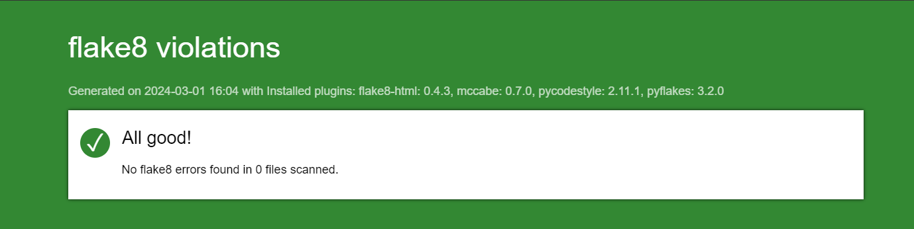
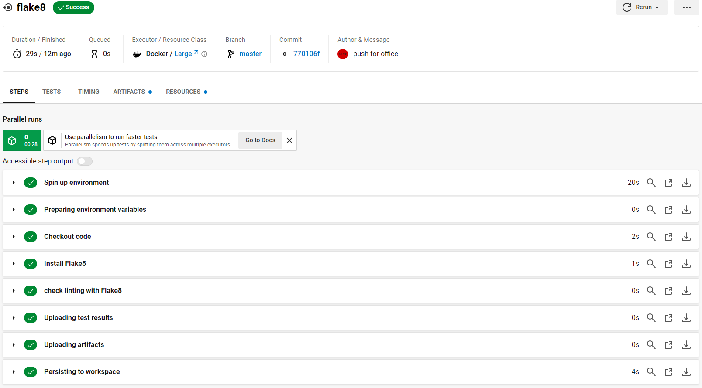

.. _flake8:

**Flake8**
==========

.. important::

    .. image:: https://img.shields.io/badge/flake8-%234B8BBE.svg?style=for-the-badge&logo=flake8&logoColor=white
        :alt: Flake8 Badge
        :target: https://flake8.pycqa.org/

    .. image:: https://img.shields.io/badge/Flake8--HTML-%234B8BBE.svg?style=for-the-badge&logo=flake8&logoColor=white
        :alt: Flake8-HTML Badge
        :target: https://pypi.org/project/flake8-html/

    Parameterizations are done to a specific project. To parameterize to the other project, go to the official 
    documentation.

-------------------------------------------------------------------------------------------------------------------------------------------------------------------------------------------

**************
What is Flake8
**************

Flake8 is a static source code analysis tool in Python.

**Static Analysis**

    * Flake8 performs a static analysis of Python code without executing it. This means that it scans the code for errors, not recommended practices, etc., without the need to run it.

**Style validation**

    * Flake8 checks whether Python code complies with style conventions defined in PEP 8 standards. It reports style violations such as incorrect indentation, lines that are too long, unnecessary spaces, etc.

**Error detection**

    * In addition to checking the style of the code, Flake8 also detects potential errors in the code, such as references to undefined variables, unused imports, endless loops, etc.

**Customizable**

    * Flake8 is customizable. You can configure the style rules you want to apply, disable certain checks or add new ones according to your specific needs.

**Integration into the Python ecosystem**

    * Flake8 is widely used in the Python ecosystem and is supported by many code editors, IDE and version control systems. It can be easily integrated into a Python development workflow to improve the quality and consistency of your code.

In summary, Flake8 is a powerful tool to ensure the quality and consistency of Python code by detecting errors, verifying compliance with style conventions, and providing static analysis of source code. Using Flake8 can help maintain clean, readable, and easily maintainable code in Python projects.

-------------------------------------------------------------------------------------------------------------------------------------------------------------------------------------------

**************
Install Flake8
**************

To install Flake8, open an interactive shell and run:

.. code-block:: python

    pipenv install flake8

If you want Flake8 to be installed for your default Python installation, you can instead use:

.. code-block:: python

    python -m pip install flake8

.. note::

    It is very important to install Flake8 on the correct version of Python for your needs. If you want Flake8 to properly parse new language features in Python 3.5 (for example), you need it to be installed on 3.5 for Flake8 to understand those features. In many ways, Flake8 is tied to the version of Python on which it runs.

-------------------------------------------------------------------------------------------------------------------------------------------------------------------------------------------

*******
.flake8
*******

⚙️ Creation and Configuration ``.flake8`` file

.. code-block:: python

    mkdir .flake8

.. code-block:: python

    [flake8]
    # it's not a bug that we aren't using all of hacking
    extend-ignore =
    # H101: Use TODO(NAME)
    H101,
    # H202: assertRaises Exception too broad
    H202,
    # H233: Python 3.x incompatible use of print operator
    H233,
    # H301: one import per line
    H301,
    # H306: imports not in alphabetical order (time, os)
    H306,
    # H401: docstring should not start with a space
    H401,
    # H403: multi line docstrings should end on a new line
    H403,
    # H404: multi line docstring should start without a leading new line
    H404,
    # H405: multi line docstring summary not separated with an empty line
    H405,
    # H501: Do not use self.__dict__ for string formatting
    H501

    max-line-length = 99

    # In .flake8 or setup.cfg, use the exclude option to specify which directories 
    # or files you want to exclude from the scan. 
    exclude =
    venv,
    .venv,
    .git,
    .gitignore,
    setup.py
    **/migrations/*,
    __pycache__,

    # filename option to exclude specific files rather than entire directories. 
    filename = 
    Lib\site-packages\urllib3\util\timeout.py, 
    Lib\site-packages\urllib3\util\url.py, 
    Lib\site-packages\whitenoise\base.py, 
    Lib\site-packages\whitenoise\middleware.py, 
    Scripts\activate_this.py

-------------------------------------------------------------------------------------------------------------------------------------------------------------------------------------------

************
Using Flake8
************

To start using Flake8, open an interactive shell and run:

.. code-block:: python

    flake8

-------------------------------------------------------------------------------------------------------------------------------------------------------------------------------------------

*******************
What is Flake8-html
*******************

Flake8-HTML is an extension of Flake8 that generates detailed HTML reports based on the results of code analysis performed by Flake8. 

**Flake8 Extension**

    * Flake8-HTML extends the functionality of Flake8 by adding the ability to generate reports in HTML format from the results of code analysis.

**Detailed Reports**

    * With Flake8-HTML, you can generate detailed HTML reports that present the results of the code analysis clearly and visually. These reports provide detailed information about style violations, errors detected and other issues identified by Flake8.

**User-friendly visualization**

    * HTML reports generated by Flake8-HTML are designed to be easy to interpret. They use a structured layout and visual elements to present the information in an understandable way.

**Customizable**

    * Flake8-HTML also offers some customization in reporting. You can configure the generation options to include or exclude certain information, choose the visual style of the reports, etc.

**Integration into workflows**

    * Flake8-HTML can be integrated into your Python workflow to provide quality reports on code quality. These reports can be used to identify and resolve problems, improving maintainability and readability of the code.

In summary, Flake8-HTML is a handy extension of Flake8 that adds the ability to generate detailed HTML reports from code analysis results, providing a clear and concise visualization of detected code quality issues. Using Flake8-HTML can help maintain clean, consistent, high-quality code in your Python projects.

-------------------------------------------------------------------------------------------------------------------------------------------------------------------------------------------

*******************
Install Flake8-html
*******************

.. code-block:: python

    pipenv install flake8-html

-------------------------------------------------------------------------------------------------------------------------------------------------------------------------------------------

Then run flake8 passing the --format=html option and a --htmldir:

.. code-block:: python

    flake8 --format=html --htmldir=flake-report

-------------------------------------------------------------------------------------------------------------------------------------------------------------------------------------------

.. raw:: html

   

       
   

-------------------------------------------------------------------------------------------------------------------------------------------------------------------------------------------

.. warning:: Before activating the button below, you must :doc:`install and activate <quick_start>` the virtual environment.

.. raw:: html

   

-------------------------------------------------------------------------------------------------------------------------------------------------------------------------------------------

****************
Flake8 pipelines
****************

**Flake8** tests were also incorporated into **circleci pipelines**.

.. raw:: html

   

       
   

-------------------------------------------------------------------------------------------------------------------------------------------------------------------------------------------

.. raw:: html

   
