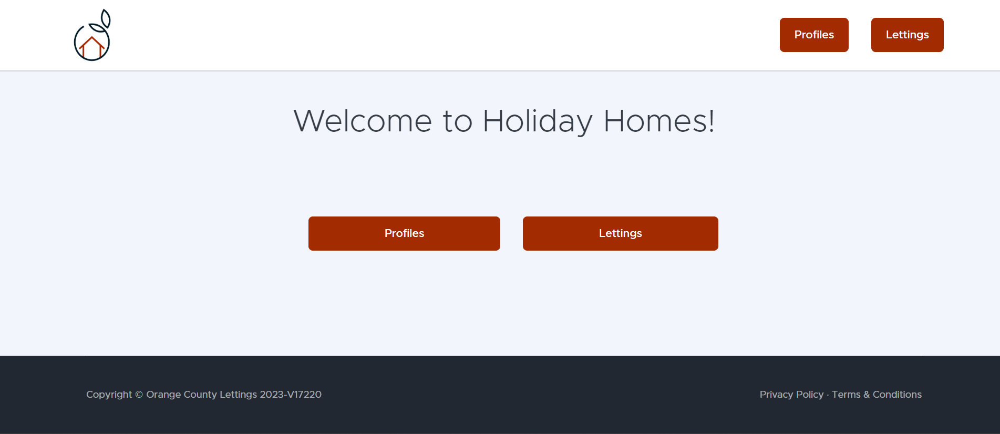

.. Orange County Lettings documentation master file, created by
   sphinx-quickstart on Mon Feb 12 07:51:44 2024.
   You can adapt this file completely to your liking, but it should at least
   contain the root `toctree` directive.
.. theorie:

**Reception**
=============

-------------------------------------------------------------------------------------------------------------------------------------------------------------------------------------------

.. important::

   This documentation was carried out as part of a training in computer development. It cannot be taken for official documentation.

-------------------------------------------------------------------------------------------------------------------------------------------------------------------------------------------

**********
Technology
**********

.. image:: https://img.shields.io/badge/python-3670A0?style=for-the-badge&logo=python&logoColor=ffdd54
   :alt: Python Badge
   :target: https://docs.python.org/3/

.. image:: https://img.shields.io/badge/django-%23092E20.svg?style=for-the-badge&logo=django&logoColor=white
   :alt: Django Badge
   :target: https://www.djangoproject.com/

.. image:: https://img.shields.io/badge/sqlite-%2307405e.svg?style=for-the-badge&logo=sqlite&logoColor=white
   :alt: Sqlite Badge
   :target: https://www.sqlite.org/index.html

.. image:: https://img.shields.io/badge/GitHub-100000?style=for-the-badge&logo=github&logoColor=white
   :alt: Gihub Badge
   :target: https://github.com/

.. image:: https://img.shields.io/badge/javascript-%23323330.svg?style=for-the-badge&logo=javascript&logoColor=%23F7DF1E*
   :alt: Javascript Badge
   :target: https://devdocs.io/javascript/

.. image:: https://img.shields.io/badge/circle%20ci-%23161616.svg?style=for-the-badge&logo=circleci&logoColor=white
   :alt: CircleCi Badge
   :target: https://circleci.com/docs/

.. image:: https://img.shields.io/badge/html5-%23E34F26.svg?style=for-the-badge&logo=html5&logoColor=white
   :alt: HTML5 Badge
   :target: https://jaetheme.com/balises-html5/

.. image:: https://img.shields.io/badge/docker-%230db7ed.svg?style=for-the-badge&logo=docker&logoColor=white
   :alt: Docker Badge
   :target: https://docs.docker.com/

.. image:: https://img.shields.io/badge/Visual%20Studio%20Code-0078d7.svg?style=for-the-badge&logo=visual-studio-code&logoColor=white
   :alt: VisualStudioCode Badge
   :target: https://code.visualstudio.com/docs

.. image:: https://img.shields.io/badge/heroku-%23430098.svg?style=for-the-badge&logo=heroku&logoColor=white
   :alt: Heroku Badge
   :target: https://devcenter.heroku.com/categories/reference

.. image:: https://img.shields.io/badge/sentry-%2319CAAD.svg?style=for-the-badge&logo=sentry&logoColor=white
   :alt: Sentry Badge
   :target: https://docs.sentry.io/

.. image:: https://img.shields.io/badge/flake8-%234B8BBE.svg?style=for-the-badge&logo=flake8&logoColor=white
   :alt: Flake8 Badge
   :target: https://flake8.pycqa.org/

.. image:: https://img.shields.io/badge/sphinx-%23C4302B.svg?style=for-the-badge&logo=sphinx&logoColor=white
   :alt: Sphinx Badge
   :target: https://www.sphinx-doc.org/

-------------------------------------------------------------------------------------------------------------------------------------------------------------------------------------------

***********
Information
***********

* **Authors** : `Laurent Jouron <https://laurentjouron.github.io/LaurentJouron.com/>`_

* **Etablissement**: Orange County Lettings

* **Projet** : Website for rental properties in the expansion phase in the United States

* **Creation date** : Feb 12, 2024

* **Modification date** : |today|

* **Document status** : In work

-------------------------------------------------------------------------------------------------------------------------------------------------------------------------------------------

****
Logo
****

.. _ma_figure:

.. figure:: _static/logo.png
   :scale: 75
   :align: center
   :alt: Logo

   :download:`Download <_static/logo.png>`

-------------------------------------------------------------------------------------------------------------------------------------------------------------------------------------------

***************
Image with logo
***************

.. _ma_figure:

.. figure:: _static/Orange_County_Lettings_logo.png
   :height: 250
   :width: 600
   :scale: 100
   :align: center
   :alt: Home work

   :download:`Download <_static/Orange_County_Lettings_logo.png>`

-------------------------------------------------------------------------------------------------------------------------------------------------------------------------------------------

*********
Home page
*********

.. _ma_figure:

   :download:`Download <_static/home_page.png>`

-------------------------------------------------------------------------------------------------------------------------------------------------------------------------------------------

*****
Links
*****

* Refer to start for more information on quick :ref:`quick start <quick_start>` installation.
* By going to description you get more details on the :ref:`description <description>` evolution of the project.
* Come and see the structure of the :ref:`database <data_structure>`.
* To see the configuration of the doc with `Sphinx <https://www.sphinx-doc.org/>`_ , I invite you to go to the :ref:`documentation <documentation>` tab.

-------------------------------------------------------------------------------------------------------------------------------------------------------------------------------------------

Indices and tables
==================

   .. toctree::
            :maxdepth: 3

            circleci
            coverage
            data_structure
            description
            docker
            documentation
            quick_start
            sentry
            test