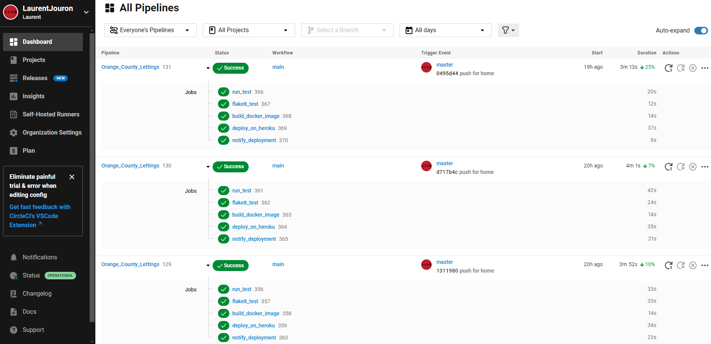
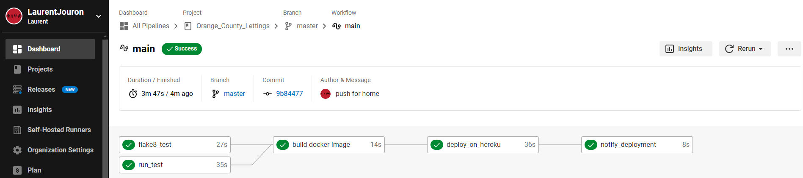
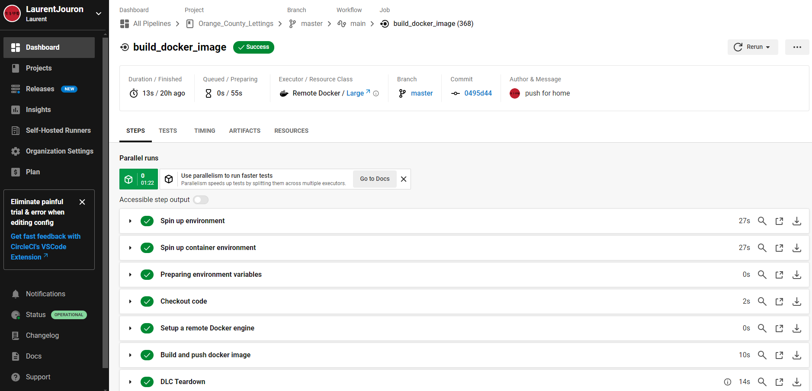
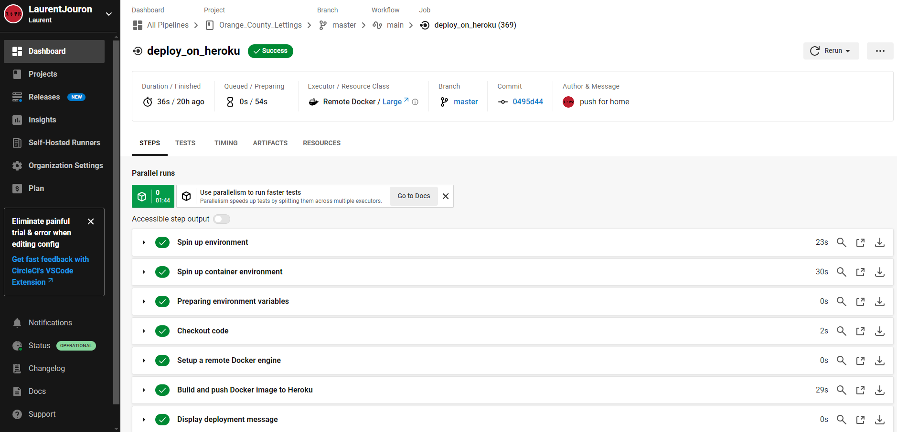

.. _pipeline:

Pipelines
=========

When a modification is done on the `Github repository <https://github.com/LaurentJouron/Orange_County_Lettings>`_ (after a commit), :doc:`CircleCi <circleci>` launch some commands.

.. raw:: html

   

       
   

After running all the tests there is a graph that can be found to make possible improvements.

.. raw:: html

   

       
   

.. raw:: html

   

-------------------------------------------------------------------------------------------------------------------------------------------------------------------------------------------

********
Run test
********

``Run_test`` pipelines are automated processes that :doc:`run tests <test>` on the source code to verify its proper operation. 
These :doc:`tests <test>` may include unit tests, integration tests, end-to-end tests, etc. 
Running ``run_test`` pipelines ensures that code changes have not introduced new bugs and that the existing code is still working properly.

.. figure:: _static/circleci_run_tests.png
   :scale: 40
   :align: center
   :alt: circleci run tests

.. raw:: html

   

       
   

.. raw:: html

   

-------------------------------------------------------------------------------------------------------------------------------------------------------------------------------------------

***********
flake8_test
***********

``Flake8_test`` pipelines are automated processes that use the :doc:`Flake8 <flake8>` tool to verify source code compliance with Python style standards. 
:doc:`Flake8 <flake8>` analyzes the code for violations of the style rules defined by `PEP 8 <https://peps.python.org/pep-0008/>`_ , as well as potential errors. 
Running flake8_test pipelines helps maintain code style consistency and identify code quality issues at the development stage.

.. figure:: _static/circleci_flake8.png
   :scale: 40
   :align: center
   :alt: circleci flake8

.. raw:: html

   

       
   

.. raw:: html

   

-------------------------------------------------------------------------------------------------------------------------------------------------------------------------------------------

******************
Build Docker image
******************

``build_docker_image`` pipelines are automated processes that create a :doc:`Docker image <docker>` from the configuration files and source code of an 
application. These pipelines use :doc:`Docker <docker>` instructions to assemble the image, which can then be deployed to development, test, or 
production environments. Running ``build_docker_image`` pipelines ensures that the :doc:`Docker image <docker>` is properly built and ready for use 
to run the application in an isolated and portable manner.

.. raw:: html

   

       
   

.. raw:: html

   

-------------------------------------------------------------------------------------------------------------------------------------------------------------------------------------------

****************
Deploy on Heroku
****************

Deploye on :doc:`Heroku <heroku>` pipelines are automated processes that deploy the application on the :doc:`Heroku <heroku>` cloud platform. 
These pipelines take the application’s source code, build the :doc:`Docker <docker>` image if necessary, and deploy it to :doc:`Heroku <heroku>` using tools like **Git**, 
**Heroku CLI**, or continuous integration services. Running deploye on :doc:`Heroku <heroku>` pipelines quickly updates the application in production on :doc:`Heroku <heroku>`, 
providing an efficient and reliable method for deploying web applications.

.. raw:: html

   

       
   

.. raw:: html

   

-------------------------------------------------------------------------------------------------------------------------------------------------------------------------------------------

*****************
Notify deployment
*****************

Notify deployment pipelines are automated processes that send notifications to inform development team members or other 
stakeholders that a deployment has been successfully completed. These notifications can be sent by email, via instant messaging platforms 
like Slack, or other means of communication. Executing notify deployment pipelines keeps all relevant parties informed of 
updates and changes to the application, enabling better collaboration and visibility into deployments.

.. figure:: _static/circleci_notify_deployment.png
   :scale: 40
   :align: center
   :alt: circleci deployment notify

.. raw:: html

   

       
   

.. raw:: html

   
