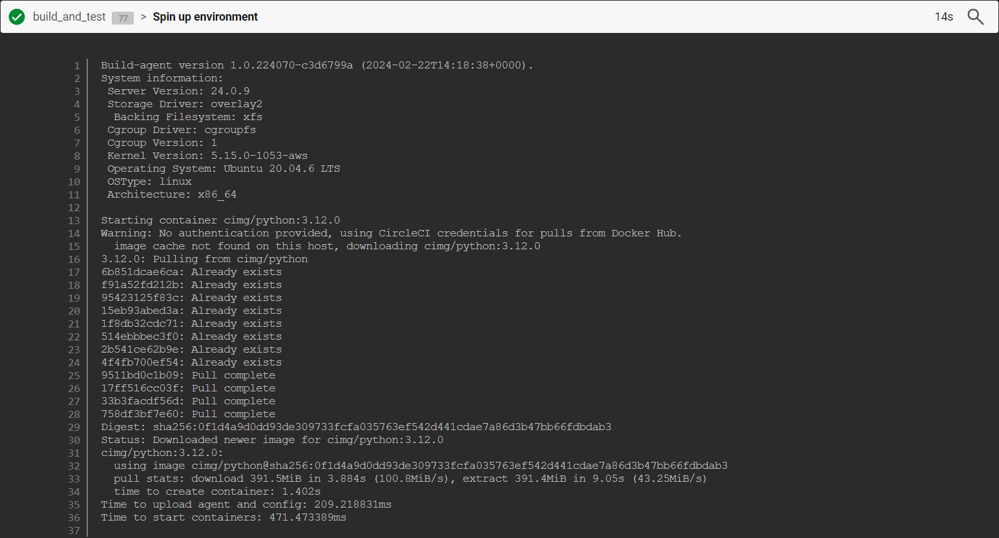
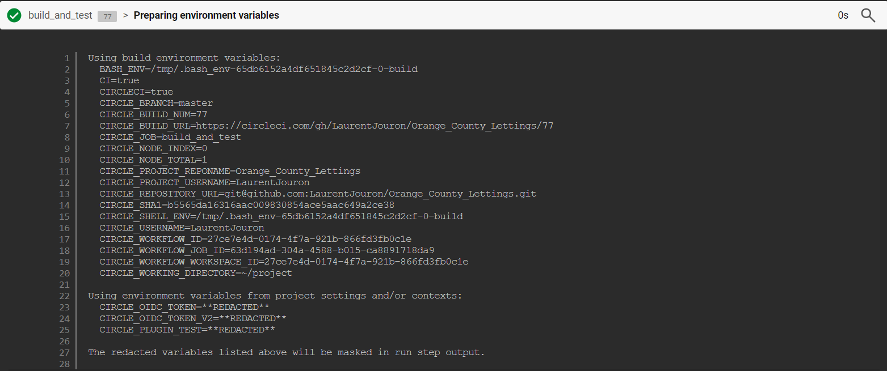
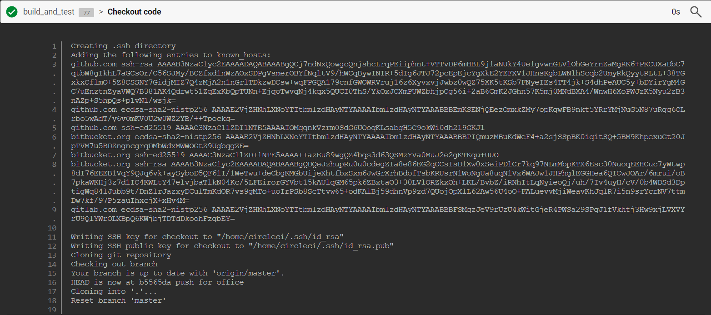
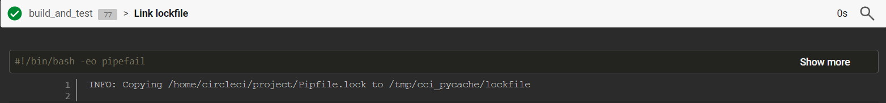
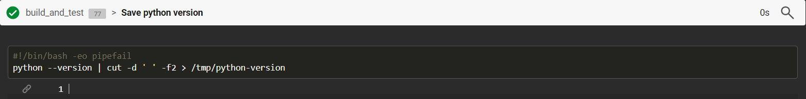
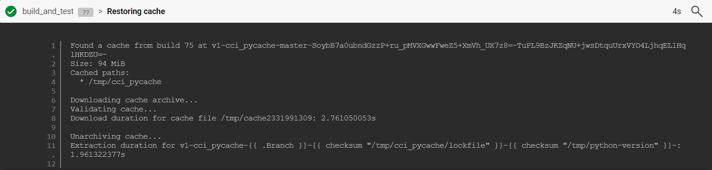
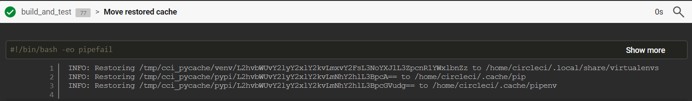
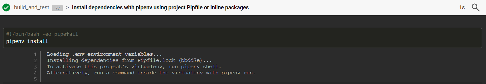
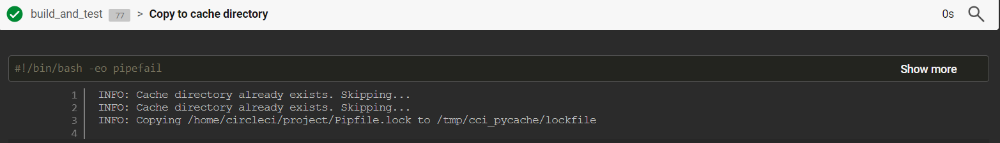
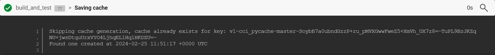

.. _pipeline:

**Pipelines**
=============

-------------------------------------------------------------------------------------------------------------------------------------------------------------------------------------------

*******************
Spin up environment
*******************

**Build-agent**

   * Specifies the version of the CircleCI build agent used to run the build.

**System information**

   * Provides information about the operating system and construction environment. In our case, the operating system is Ubuntu 20.04.6 LTS, with a Linux kernel 5.15.0-1053-aws.

**Starting container**

   * Indicates the start of a Docker container based on the cimg/python:3.12.0 image, necessary to execute the construction steps.

**Warning: No authentication provided**

   * This warning indicates that no authentication has been provided to pull the image from Docker Hub. CircleCI uses its own credentials for this.

**Image cache not found on this host, downloading cimg/python:3.12.0**

   * Indicates that the Docker cimg/python:3.12.0 image is not present in the local cache of the build host and must therefore be downloaded from the Docker Hub.

**cimg/python:3.12.0**

   * Detailed information about the downloaded Docker image, including its SHA256 hash.

**Pull stats**

   * Statistics on downloading and extracting the Docker image, indicating the time required and the download speed.

**Time to create container**

   * Time required to create the Docker container from the uploaded image.

**Time to upload agent and config**

   * Time required to download the build agent and configuration file.

**Time to start containers**

   * The time it takes to start Docker containers to complete the construction steps.

This release provides an overview of the CircleCI build environment startup process and the download of dependencies needed to run the build steps.

.. raw:: html

   

       
   

-------------------------------------------------------------------------------------------------------------------------------------------------------------------------------------------

*******************************
Preparing environment variables
*******************************

💡 Construction environment variables: BASH_ENV, CIRCLECI, CI, etc...:

   * These variables are defined by the CircleCI build environment to provide information about the current process. 

   * Example

      * **CIRCLE_BRANCH** contains the name of the current branch (master in this case), 
      * **CIRCLE_BUILD_NUM** contains the build number
      * **CIRCLE_BUILD_URL** provides the URL of the build details page on the CircleCI dashboard.

💡 Project environment variables: CIRCLE_USERNAME, CIRCLE_PROJECT_REPONAME, CIRCLE_REPOSITORY_URL, etc...:

   * These variables are derived from the CircleCI project parameters and provide specific information about the project under construction.

   * Example

      * **CIRCLE_USERNAME** contains the project owner username, 
      * **CIRCLE_PROJECT_REPONAME** contains the repository name
      * **CIRCLE_REPOSITORY_URL** contains the Git repository URL.

💡 Workflow environment variables: CIRCLE_WORKFLOW_ID, CIRCLE_WORKFLOW_JOB_ID, etc...:

   * These variables are associated with the running workflow. They provide information about the workflow ID, the job ID in the workflow, and the workflow workspace ID.

💡 Other variables: CIRCLE_OIDC_TOKEN, CIRCLE_OIDC_TOKEN_V2, CIRCLE_PLUGIN_TEST:

   * These variables are project-specific and can be used to store sensitive information or API keys. In this case, they are redacted (**REDACTED**) for security reasons. This pipeline appears to be a build and test (**build_and_test**) phase of your Orange County Lettings project. It is triggered on the master branch and uses various environment variables to retrieve information about the context of the build.

.. raw:: html

   

       
   

-------------------------------------------------------------------------------------------------------------------------------------------------------------------------------------------

**Checkout code**

   * This part of the build output is related to the configuration and use of SSH keys to access Git repositories.

**Creating .ssh directory**

   * Creates the . ssh directory in the user directory to store the SSH keys.

**Adding the following entries to known_hosts**

   * Added Git host public key (**GitHub, Bitbucket, GitLab**) to known_hosts file. This allows the trusted host (CircleCI) to identify the Git host and ensure that it connects to the correct server.

**Writing SSH key for checkout**

   * Generates a private SSH key (``id_rsa``) and a public key (``id_rsa.pub``) for authentication when retrieving source code from the Git repository.

**Cloning git repository**

   * Clone the Git repository to the current working directory.

**Checking out branch** 

   * Checks the specified branch. In this case, it is mentioned that the branch is up to date with origin/master and that the HEAD is now on the latest revision of this branch.

These steps ensure that CircleCI can access the Git repository using SSH keys and retrieve the source code for construction.

.. raw:: html

   

       
   

-------------------------------------------------------------------------------------------------------------------------------------------------------------------------------------------

💡 Link lockfile

This part indicates that a Pipfile.lock file is copied from the ``/home/circleci/project/`` directory to a temporary /tmp/cci_pycache/lockfile directory.

The ``Pipfile.lock`` file is generated by **Pipenv** and contains information about specific Python dependencies with their exact versions. It is used to ensure that the same versions of dependencies in different environments.

Copying this file to a temporary directory is a preparatory step for installing dependencies or other operations that require this file.

.. raw:: html

   

       
   

-------------------------------------------------------------------------------------------------------------------------------------------------------------------------------------------

💡 Save Python version

This script extracts the version of Python installed on the runtime and stores it in a file named **python-version** in the temporary directory ``/tmp/``.

Here is what each part of the script does:

**#!/bin/bash -eo pipefail**

   * This line indicates that the script should be interpreted by **Bash** (``#!/bin/bash``) with the **-eo pipefail. -e** means "exit on error", and **-o pipefail** means that the script will fail if one of the commands in a command chain (``pipeline``) fails.

**python --version**

   * This command runs python --version to get the version of **Python** installed. The ``--version`` option asks Python to display its **version**, and the output is directed to the standard output.

**cut -d ' ' -f2**

   * This command uses cut to extract the second column (bounded by a space) from the python ``--version`` output, which corresponds to the **Python version**.

**/tmp/python-version**

   * This part redirects the output of the previous command to the ``/tmp/python-version`` file, where the Python version is stored.

In summary, this Bash script retrieves the version of Python and stores it in a file for later reference or for use in other construction steps.

.. raw:: html

   

       
   

-------------------------------------------------------------------------------------------------------------------------------------------------------------------------------------------

💡 Restoring cache

Cette partie de la sortie indique que CircleCI a trouvé un cache de la construction précédente (build 75) pour les chemins spécifiés, et il essaie de le télécharger pour l'utiliser dans cette construction actuelle.

Voici ce que chaque partie signifie :

Found a cache from build 75 : Indique que CircleCI a trouvé un cache à partir de la construction précédente avec le numéro de build 75.

Size: 94 MiB : Indique la taille du cache trouvé.

Cached paths : Liste les chemins des fichiers ou répertoires qui sont inclus dans le cache. Dans ce cas, seul /tmp/cci_pycache est inclus.

Downloading cache archive : Indique que CircleCI télécharge l'archive du cache.

Validating cache : Valide l'archive du cache après son téléchargement.

Download duration for cache file : Indique la durée nécessaire pour télécharger l'archive du cache.

Unarchiving cache : Décompresse l'archive du cache.

Extraction duration : Indique la durée nécessaire pour extraire l'archive du cache.

L'utilisation de cache dans CircleCI permet de stocker des artefacts ou des fichiers temporaires entre les builds afin d'accélérer les builds suivantes en évitant de refaire certaines étapes. Dans ce cas, le cache semble contenir des fichiers temporaires ou des artefacts liés à l'installation des dépendances Python.

.. raw:: html

   

       
   

-------------------------------------------------------------------------------------------------------------------------------------------------------------------------------------------

📜 Move restored cache

Ces lignes de la sortie indiquent que CircleCI restaure des éléments du cache précédent vers leurs emplacements d'origine dans l'environnement de construction actuel. Voici ce que chaque ligne signifie :

Restoring /tmp/cci_pycache/venv/L2hvbWUvY2lyY2xlY2kvLmxvY2FsL3NoYXJlL3ZpcnR1YWxlbnZz to /home/circleci/.local/share/virtualenvs : Cela signifie que CircleCI restaure un environnement virtuel précédemment sauvegardé (probablement créé avec Virtualenv) depuis le cache vers le répertoire /home/circleci/.local/share/virtualenvs.

Restoring /tmp/cci_pycache/pypi/L2hvbWUvY2lyY2xlY2kvLmNhY2hlL3BpcA== to /home/circleci/.cache/pip : Cette ligne indique que CircleCI restaure des packages Python précédemment téléchargés depuis le cache vers le répertoire de cache Pip (/home/circleci/.cache/pip). L'identifiant crypté (comme L2hvbWUvY2lyY2xlY2kvLmNhY2hlL3BpcA==) fait référence à un chemin spécifique dans le cache.

Restoring /tmp/cci_pycache/pypi/L2hvbWUvY2lyY2xlY2kvLmNhY2hlL3BpcGVudg== to /home/circleci/.cache/pipenv : Cela indique que des packages Python précédemment téléchargés spécifiquement pour Pipenv sont restaurés depuis le cache vers le répertoire de cache Pipenv (/home/circleci/.cache/pipenv).

Ces étapes de restauration du cache contribuent à accélérer le processus de construction en évitant de télécharger à nouveau des dépendances déjà présentes dans le cache. Cela est particulièrement utile dans les constructions suivantes où les mêmes dépendances sont utilisées.

.. raw:: html

   

       
   

-------------------------------------------------------------------------------------------------------------------------------------------------------------------------------------------

📜 Install dependencies with pipenv using project Pipfile or inline packages

Ces lignes de sortie indiquent différentes étapes dans le processus de construction de votre projet. Voici ce que chacune d'entre elles signifie :

Loading .env environment variables... : Cette étape charge les variables d'environnement à partir du fichier .env. Ce fichier est souvent utilisé pour stocker des variables sensibles ou spécifiques à l'environnement, telles que les clés d'API ou les informations de configuration.

Installing dependencies from Pipfile.lock (bbdd7e)... : Cette étape installe les dépendances Python spécifiées dans le fichier Pipfile.lock. Le contenu entre parenthèses, dans ce cas (bbdd7e), fait référence à la version spécifique du fichier Pipfile.lock utilisée pour installer les dépendances. Cela garantit que les mêmes versions exactes des dépendances sont installées à chaque fois.

To activate this project's virtualenv, run pipenv shell. Alternatively, run a command inside the virtualenv with pipenv run. : Ces instructions indiquent comment activer l'environnement virtuel du projet créé par Pipenv. L'utilisation d'un environnement virtuel permet d'isoler les dépendances du projet des autres projets et du système hôte. Vous pouvez activer l'environnement virtuel en exécutant pipenv shell ou exécuter des commandes à l'intérieur de l'environnement virtuel avec pipenv run.

Après ces étapes, votre projet est prêt à être exécuté ou à être soumis à d'autres processus de construction ou de déploiement.

.. raw:: html

   

       
   

-------------------------------------------------------------------------------------------------------------------------------------------------------------------------------------------

📜 Copy to cache directory

Ces lignes de sortie indiquent que CircleCI a détecté que le répertoire de cache existe déjà et qu'il a donc été sauté. Ensuite, il copie le fichier Pipfile.lock de votre projet vers le répertoire de cache.

Voici ce que chaque ligne signifie :

Cache directory already exists. Skipping... : Cela signifie que le répertoire de cache a déjà été créé lors d'une construction précédente et qu'il n'est donc pas nécessaire de le créer à nouveau. Le processus de construction passe à l'étape suivante.

Copying /home/circleci/project/Pipfile.lock to /tmp/cci_pycache/lockfile : Cette ligne indique que le fichier Pipfile.lock de votre projet est copié vers le répertoire de cache (/tmp/cci_pycache/lockfile). Le fichier Pipfile.lock contient des informations sur les dépendances Python spécifiques avec leurs versions exactes et est utilisé pour garantir la reproductibilité de l'environnement d'exécution.

Ces étapes contribuent à optimiser le processus de construction en évitant de recréer des éléments déjà présents dans le cache lorsque cela est possible.

.. raw:: html

   

       
   

-------------------------------------------------------------------------------------------------------------------------------------------------------------------------------------------

📜 Saving cache

Ces lignes de sortie indiquent que la génération du cache a été ignorée car un cache existe déjà pour la clé spécifiée. La clé du cache est un identifiant unique qui dépend généralement des fichiers ou des répertoires inclus dans le cache, ainsi que de leurs états respectifs.

Voici ce que chaque ligne signifie :

Skipping cache generation, cache already exists for key: ... : Cela signifie que CircleCI a vérifié l'existence d'un cache pour la clé spécifiée, et a constaté qu'un cache existe déjà. Par conséquent, la génération du cache est ignorée car elle n'est pas nécessaire.

Found one created at ... : Cette ligne indique que CircleCI a trouvé un cache qui a été créé à une certaine date et heure précises. Cela permet à l'utilisateur de connaître l'âge du cache actuellement utilisé.

La présence de caches peut accélérer le processus de construction en évitant de refaire certaines étapes qui ont déjà été exécutées et en réutilisant les résultats des constructions précédentes. 

.. raw:: html

   

       
   

-------------------------------------------------------------------------------------------------------------------------------------------------------------------------------------------

📜 Run test

Ces lignes de sortie représentent le rapport de test généré par Pytest pour votre projet. Voici ce que chaque partie signifie :

Loading .env environment variables... : Cette étape charge les variables d'environnement à partir du fichier .env, qui est souvent utilisé pour stocker des variables sensibles ou spécifiques à l'environnement, telles que les clés d'API ou les informations de configuration.

============================= test session starts ============================== : Cela indique le début de la session de test.

platform linux -- Python 3.12.0, pytest-8.0.2, pluggy-1.4.0 : Cette ligne fournit des informations sur la plateforme (Linux), la version de Python (3.12.0), la version de Pytest (8.0.2) et la version de Pluggy (1.4.0).

django: version: 5.0.2, settings: oc_lettings_site.settings (from ini) : Cette ligne indique la version de Django utilisée (5.0.2) et les paramètres de configuration spécifiés dans le fichier pytest.ini.

rootdir: /home/circleci/project : Cela indique le répertoire racine du projet où les tests ont été exécutés.

configfile: pytest.ini : Cela indique le fichier de configuration utilisé pour les tests (dans ce cas, pytest.ini).

plugins: cov-4.1.0, django-4.8.0 : Cette ligne indique les plugins Pytest utilisés, tels que le plugin de couverture (cov) et le plugin Django (django).

collected 13 items : Cela indique le nombre total de tests collectés (13 dans ce cas).

lettings/test_lettings/test_lettings.py ...... [ 46%] : Cela montre les résultats des tests pour les fichiers de test situés dans le répertoire lettings/test_lettings. Dans cet exemple, 46% des tests dans ce répertoire ont réussi.

oc_lettings_site/test_oc_lettings_site/test_oc_lettings_site.py .. [ 61%] : Cela montre les résultats des tests pour les fichiers de test situés dans le répertoire oc_lettings_site/test_oc_lettings_site. Dans cet exemple, 61% des tests dans ce répertoire ont réussi.

profiles/test_profiles/test_profiles.py ..... [100%] : Cela montre les résultats des tests pour les fichiers de test situés dans le répertoire profiles/test_profiles. Dans cet exemple, 100% des tests dans ce répertoire ont réussi.

Coverage HTML written to dir htmlcov : Cela indique que le rapport de couverture a été généré au format HTML et enregistré dans le répertoire htmlcov.

============================== 13 passed in 5.13s ============================== : Cela indique que tous les tests ont réussi (13 au total) et qu'ils ont été exécutés en 5.13 secondes.

En résumé, ces lignes fournissent un aperçu des tests exécutés, de leur succès ou de leur échec, ainsi que des statistiques sur la session de test dans son ensemble

.. figure:: _static/circleci_run_tests.png
   :scale: 50
   :align: center
   :alt: circleci run tests

.. raw:: html

   

       
   

-------------------------------------------------------------------------------------------------------------------------------------------------------------------------------------------

📜 Persisting to workspace

La sortie indique que CircleCI est en train de créer une archive de l'espace de travail, qui comprend généralement les fichiers et répertoires nécessaires à l'exécution du pipeline. Une fois l'archive créée, elle est téléchargée vers l'emplacement spécifié.

Dans votre cas, l'archive de l'espace de travail a été téléchargée avec succès après avoir été créée. La taille totale téléchargée est de 36 MiB, ce qui signifie que l'ensemble des fichiers de l'espace de travail à télécharger est de cette taille.

Cette étape est généralement effectuée pour sauvegarder l'état de l'espace de travail à un certain point du pipeline, ce qui peut être utile pour le débogage ou pour analyser l'état du projet à ce moment précis.

.. figure:: _static/circleci_persisting_to_workspace.png
   :scale: 50
   :align: center
   :alt: circleci persisting to workspace

.. raw:: html

   

       
   

-------------------------------------------------------------------------------------------------------------------------------------------------------------------------------------------

.. raw:: html

   

-------------------------------------------------------------------------------------------------------------------------------------------------------------------------------------------