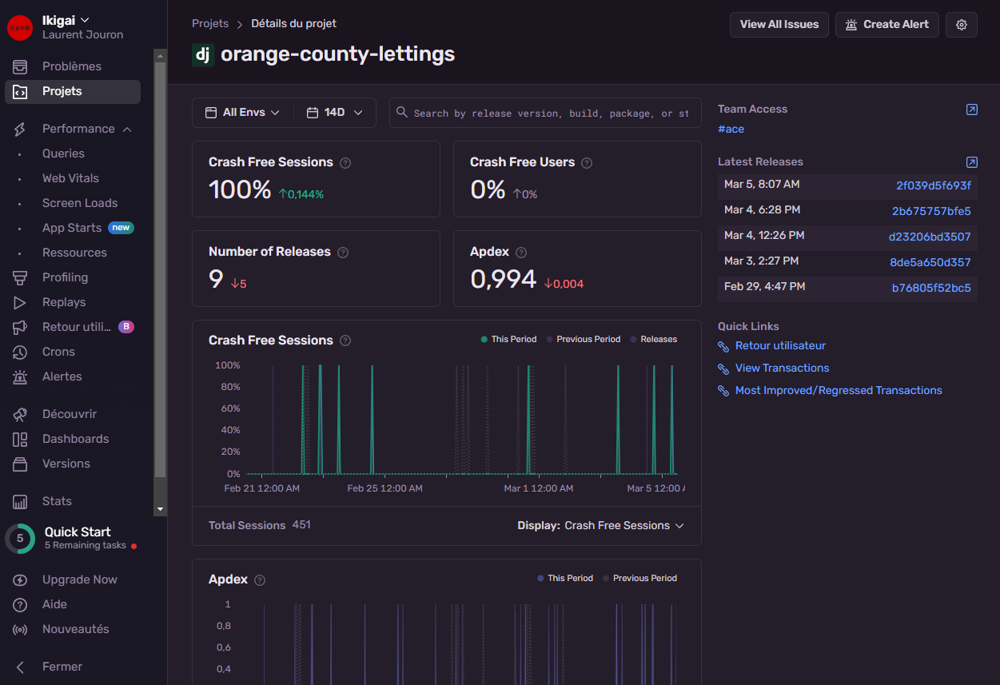

.. _sentry:

Sentry
======

.. important::

    .. image:: https://img.shields.io/badge/sentry-%2319CAAD.svg?style=for-the-badge&logo=sentry&logoColor=white
        :alt: Sentry Badge
        :target: https://docs.sentry.io/

    Parameterizations are done to a specific project. To parameterize to the other project, go to the official 
    documentation.

-------------------------------------------------------------------------------------------------------------------------------------------------------------------------------------------

**************
What is Sentry
**************

Sentry is an error management platform that captures, tracks and resolves errors and exceptions. It provides detailed information about errors, local variables, and runtime information. 
This allows developers to diagnose and resolve issues quickly. `Sentry's Django integration <https://docs.sentry.io/platforms/python/integrations/django/>`_

-------------------------------------------------------------------------------------------------------------------------------------------------------------------------------------------

**************
Install Sentry
**************

Install sentry-sdk from PyPI with the django extra:

.. code-block:: python

    pip install --upgrade 'sentry-sdk[django]'

-------------------------------------------------------------------------------------------------------------------------------------------------------------------------------------------

****
.env
****

To configure the Sentry SDK, initialize it in your settings.py file:

.. code-block:: python

    DSN="https://5748bad655e9f1da78f2dc955c0fd451@o4506677079900160.ingest.sentry.io/4506710341844992"

-------------------------------------------------------------------------------------------------------------------------------------------------------------------------------------------

***********
settings.py
***********

By adding DjangoIntegration explicitly to your sentry_sdk.init() call you can set options for DjangoIntegration to change its behavior:

.. code-block:: python

    # setting.py

    import os
    import environ
    import sentry_sdk
    from sentry_sdk.integrations.django import DjangoIntegration

    sentry_sdk.init(
        dsn=os.environ["DSN"],
        traces_sample_rate=1.0,
        profiles_sample_rate=1.0,
        enable_tracing=True,
        integrations=[
            DjangoIntegration(
                transaction_style="url",
                middleware_spans=True,
                signals_spans=False,
                cache_spans=False,
            ),
        ],
    )

-------------------------------------------------------------------------------------------------------------------------------------------------------------------------------------------

*******
LOGGING
*******

For a precise setting of the errors, it is necessary to use the installation `logging <https://docs.djangoproject.com/fr/2.2/topics/logging/>`_

.. code-block:: python

    # setting.py

    LOGGING = {
        "version": 1,
        "disable_existing_loggers": False,
        "handlers": {
            "console": {
                "class": "logging.StreamHandler",
            },
        },
        "root": {
            "handlers": ["console"],
            "level": "WARNING",
        },
        "loggers": {
            "django": {
                "handlers": ["console"],
                "level": os.getenv("DJANGO_LOG_LEVEL", "INFO"),
                "propagate": False,
            },
        },
    }

-------------------------------------------------------------------------------------------------------------------------------------------------------------------------------------------

*******************
reception dashboard
*******************

.. raw:: html

   

       
   

-------------------------------------------------------------------------------------------------------------------------------------------------------------------------------------------

******************
frontend dashboard
******************

   .. figure:: _static/sentry_frontend.png
    :scale: 55
    :align: center
    :alt: sentry frontend

.. raw:: html

   

       
   

-------------------------------------------------------------------------------------------------------------------------------------------------------------------------------------------

*****************
backend dashboard
*****************

   .. figure:: _static/sentry_backend.png
    :scale: 55
    :align: center
    :alt: sentry backend

.. raw:: html

   

       
   

-------------------------------------------------------------------------------------------------------------------------------------------------------------------------------------------

************
Email report
************

If everything is set properly, the confirmation emails receive it regularly depending on the settings.

   .. figure:: _static/sentry_journalisation.png
    :scale: 85
    :align: center
    :alt: sentry journalisation

.. raw:: html

   

       
   

-------------------------------------------------------------------------------------------------------------------------------------------------------------------------------------------

.. raw:: html

   