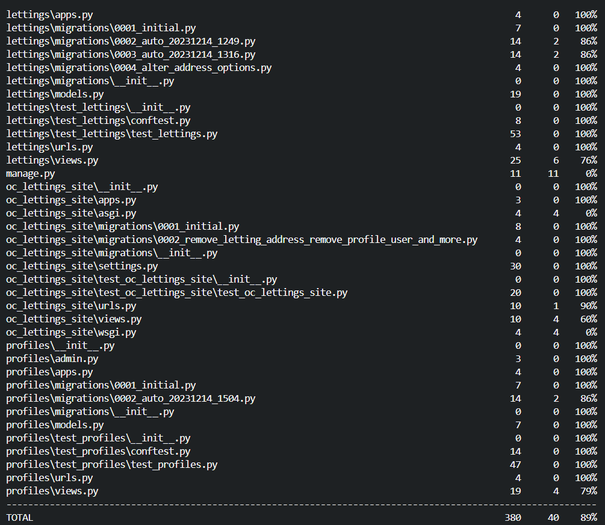

.. _test:

**Pytest-Django**
=================

.. important::

    .. image:: https://img.shields.io/badge/pytest--django-%232C8736.svg?style=for-the-badge&logo=pytest&logoColor=white
        :alt: Pytest-Django Badge
        :target: https://pytest-django.readthedocs.io/en/latest/

    .. image:: https://img.shields.io/badge/django-%23092E20.svg?style=for-the-badge&logo=django&logoColor=white
        :alt: Django Badge
        :target: https://www.djangoproject.com/
    
    The configuration below is very inspired by the official file `pytest-django <https://pytest-django.readthedocs.io/en/latest/>`_ 

pytest-django is a plugin for `pytest <https://docs.pytest.org/en/8.0.x/>`_  that provides a set of useful tools 
for testing `Django <https://www.djangoproject.com/>`_ applications and projects.

-------------------------------------------------------------------------------------------------------------------------------------------------------------------------------------------

*************
Configuration
*************

.. code-block:: console

   pip install pytest-django

Make sure ``DJANGO_SETTINGS_MODULE`` is 
defined (`see Configuring Django settings <https://pytest-django.readthedocs.io/en/latest/configuring_django.html#configuring-django-settings>`_) 
and make your tests discoverable (`see My tests are not being found. Why? <https://pytest-django.readthedocs.io/en/latest/faq.html#faq-tests-not-being-picked-up>`_):

-------------------------------------------------------------------------------------------------------------------------------------------------------------------------------------------

**********
pytest.ini
**********

Créer un fichier pytest.ini

.. code-block:: python
   
   touch pytest.ini

⚙️ pytest.ini file configuration

.. code-block:: python

    # pytest.ini
   [pytest]
   DJANGO_SETTINGS_MODULE = oc_lettings_site.settings
   # -- recommended but optional:
   python_files = tests.py test_*.py *_tests.py
   addopts = -v

-------------------------------------------------------------------------------------------------------------------------------------------------------------------------------------------

********
Run test
********

⏩️ Run your tests with ``pytest``:

.. code-block:: python

    pytest

.. _ma_figure:

.. raw:: html

   

       
   

-------------------------------------------------------------------------------------------------------------------------------------------------------------------------------------------

***********
pytest -vvv
***********

⏩️ To view test details in the terminal, use the ``-vvv`` option with pytest:

.. code-block:: console

    pytest -vvv

.. _ma_figure:

.. figure:: _static/test_vvv.png
   :scale: 50
   :align: center
   :alt: test vvv

.. raw:: html

   

       
   

-------------------------------------------------------------------------------------------------------------------------------------------------------------------------------------------

**************
pytest --cov=.
**************

To measure the test coverage of a project, run pytest with the ``--cov`` option to specify the folder to be analyzed:

.. code-block:: console

    pytest --cov=.

.. _ma_figure:

.. raw:: html

   

       
   

-------------------------------------------------------------------------------------------------------------------------------------------------------------------------------------------

***********
Report HTML
***********

⚙️ pytest --cov=. --cov-report html

To generate an HTML report automatically, use the ``--cov-report html`` option with pytest:

.. code-block:: console

    pytest --cov=. --cov-report html

Then, open the ``htmlcov`` folder and launch ``index.html`` in a browser to view the report.

.. _ma_figure:

.. figure:: _static/report_test.png
   :scale: 50
   :align: center
   :alt: Resport test

.. raw:: html

   

       
   

-------------------------------------------------------------------------------------------------------------------------------------------------------------------------------------------

*********************
Report pipelines test
*********************

.. raw:: html

   
